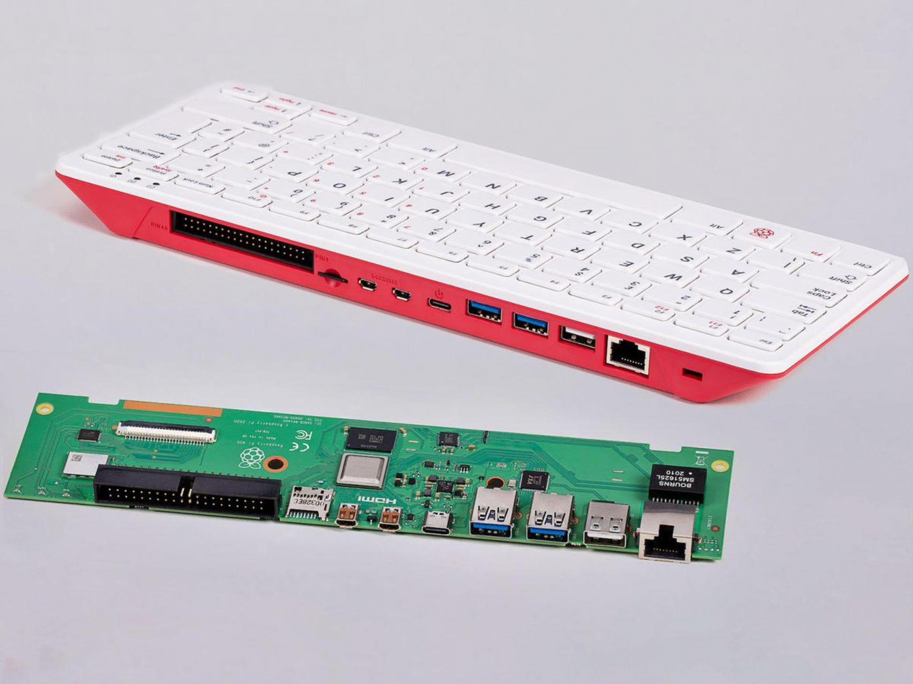
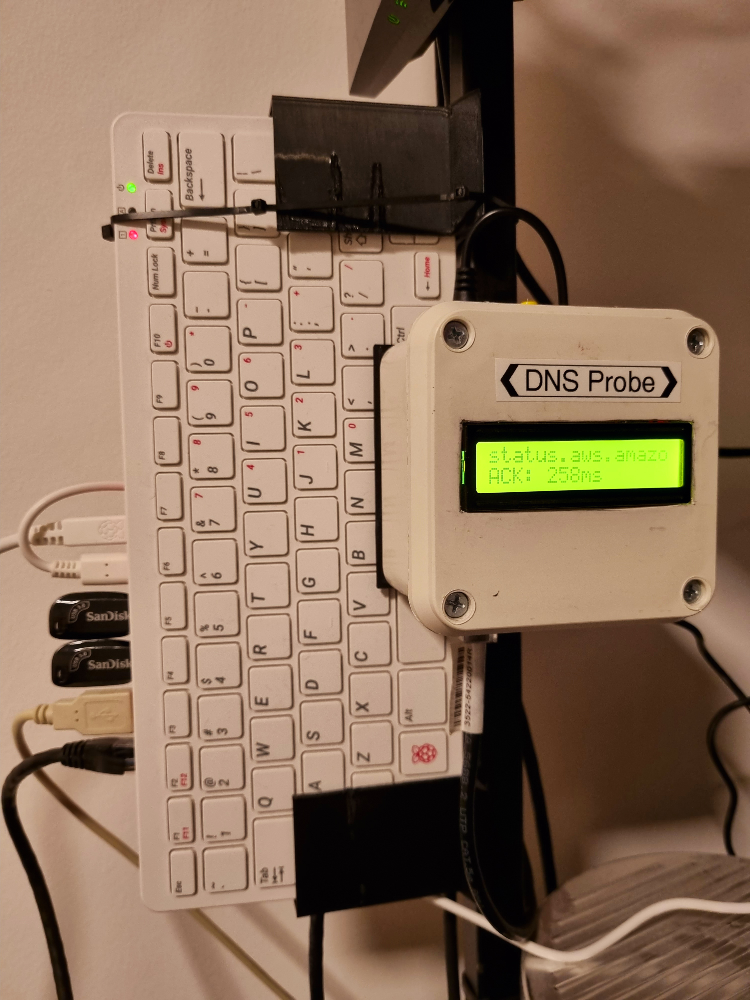

{
    "title": "A DNS Keyboard",
    "description": "An unexpected duo to help secure your everyday browsing",
    "tags": ["dns", "pihole", "networking"],
    "date": "2022-07-17T18:30:15-03:00",
    "categories": ["Networking", "Raspberry Pi", "Tutorial"],
    "type": "article",
    "weight": 0,
    "publishdate": null,
    "expirydate": null,
    "aliases": null,
    "slug": "a_dns_keyboard",
    "url": ""
}

What does a keyboard and a DNS server have in common? at a first glance it may seem that not much, although the current state of privacy and semiconductor consumer market may have have inadvertently closed that gap.

## Raspberry Pi

The Raspberry Pi Foundation arguably made a crucial change to the SoC market when they introduced the first Raspberry Pi series in 2012; An accessible, easy to use and extensible platform based on an ARM CPU with a robust set of features already included on the base board (also called SBCs instead of SoCs, as a matter of facilities amount). Did I comment that it also runs Linux? It quickly became a success, ranging from robotics and embedded applications to empowering people and children alike to take their first steps into computing and development

It wouldn't pass a long time until the software community hopped aboard and started contributing back a variety of applications that proved how useful the platform (and the rest of its newborn competitors) were, as we're about to see

## Privacy, security and their lack thereof

Whether the complete blockage of online ads should be done (as some sites survive alone on their revenue) is way beyond the scope of this post as a discussion. What is indeed at hand, is that [from](https://arstechnica.com/gadgets/2021/07/with-help-from-google-impersonated-brave-com-website-pushes-malware/) [time](https://arstechnica.com/information-technology/2016/03/big-name-sites-hit-by-rash-of-malicious-ads-spreading-crypto-ransomware/) [to](https://arstechnica.com/information-technology/2018/02/ad-network-uses-advanced-malware-technique-to-conceal-cpu-draining-mining-ads/) [time](https://arstechnica.com/information-technology/2015/04/google-kills-200-ad-injecting-chrome-extensions-says-many-are-malware/) ad networks of dubious reputation and users with malicious intent have abused these mechanisms to deliver malware. As a milder variant, some entities and companies tuned their dial up to 11 in regards of user privacy with their telemetry and trackers usage

The [Electronic Frontier Foundation](https://www.eff.org/issues/privacy) has more than plenty of material and articles on this and more related matters for anyone interested

As I engage in endless discussions with my friends and colleagues about these issues, the community is always on the look and there are a lot of privacy friendly implementations like [Signal](https://signal.org/) which mitigate some of these worrying news headlines

Ignorance is bliss, some may say. In this day and age, people should be entitled to their privacy, specially if its abolishment results in economic profit for which they will not get any share of, nor decision power upon that data. Even though we're unexpected victims of social cohesion and end user agreements of the defacto standards for engagement -after all, using Signal or even Telegram results in a sisyphean effort if your (even reduced) social circle refuses to tag along- the level of data gathering is staggering and abusive, even for free services which do not give the option of paying a fee to be outside this circle: "you are the product", the saying goes

In this scenario network wide coverage becomes an important feature, even if as a mitigation, as it provides complete and application and device-agnostic coverage. To put it in a more hierarchical way, you can block domains in the following, ascending ways (in order of locality):

* **Site-level**: Let's assume you use a bookmarklet or tampermonkey script to mitigate ads on a specific site's DOM and load events. Your millage may vary, and it only works on a single site, in an unreliable way
* **Browser-level**: Basically, the old good ad-blocker. While there's an [ongoing effort]((https://www.eff.org/es/deeplinks/2021/12/googles-manifest-v3-still-hurts-privacy-security-innovation)) to cripple them, they effectively work (as of today) as script and DOM element filters on the domain level, working across all sites. [uBlock Origin](https://addons.mozilla.org/es/firefox/addon/ublock-origin/) is the premium standard in ad-blocking across all mainline browsers
* **Host-level**: You can do the former on a machine level via its hosts file (be it /etc/hosts and %SYSTEM32%\Drivers\etc\hosts on Windows). Pi-hole can be installed on a single host to perform this task locally on steroids
* **Network level**: A network host acting as a DNS resolver (or resolver proxy) with filtering policies can perform the former on a network wide level. Pi-hole is designed for this use case. The added benefit is that this helps protecting against trackers and telemetry on every device using the network (including any smart device). Also, if the ad-blocking extension efforts on the browsers continue, while less functional, this will still provide a very similar level of protection across all browsers (sans the DOM and script handling)

## Meet pi-hole

[Pi-hole](https://pi-hole.net/) is a wonderful, open-source project which aims to do a very integral task to anyone who cares about security and privacy alike: the goal of "Network-wide Ad Blocking" (or, more specifically, DNS filtering), featuring its custom [filtering engine](https://github.com/pi-hole/FTL). As I mentioned before, I do not plan to talk about exclusion lists or whether to handle ads, trackers, telemetry or the whole bulk, as it is a discussion beyond the scope of this post. But the main takeaways I want you to get for now are the following:

* **Network wide:** A device with pi-hole installed, gets set up as you local DNS server (proxy, at first) and voila, you have your network-wide ad blocker
* **Ease of use:** As you might expect from any network-related took, it has its quirks upon configuration and installation for those not familiar with networking but it is as friendly as it can get and it has a web GUI for local and remote administration
* **Linux support:** it is compatible with a plethora of linux distributions
* **Raspberry Pi support:** As the name suggests, it has first-class support for ARM Linux, and namely, Raspbian (alias Raspberry OS)

This is a good prompt for introducing some of the Raspberry Pi models

## Meet Raspberry Pi (series 4)

Raspberry Pi (series 4) features several models

* **Raspberry Pi 4 Model B:** 4× Cortex-A72 1.5 GHz or 1.8 GHz (1, 2, 4 or 8 GB RAM) - The classic board with peripheral and ethernet ports
* **Raspberry Pi Compute Module 4 (and Lite):** 4× Cortex-A72 1.5 GHz (1, 2, 4 or 8 GB RAM) - Intended for consumer electronics designers to use as the core of their own products
* **Raspberry Pi 400**: 4× Cortex-A72 1.8 GHz, 4 GB RAM - This new model family (introduced with [series 4](https://www.raspberrypi.com/news/designing-raspberry-pi-400/)) leverages the model B into a new PCB factor inside a keyboard case, prepared for final users as a desktop computer or multimedia center. It should be noted that, spec-wise, is slightly more powerful than a standard 4 GB Model B

As the post title suggest, you may see where this is going

### Why the Raspberry Pi 400 as a network device?

Well, one of the first things I barely mentioned at the start is the current state of the semiconductor industry. On a global scale, there is a little [supply crisis](https://en.wikipedia.org/wiki/2020%E2%80%93present_global_chip_shortage), and basically everything containing a microchip is affected; with the Raspberry Pi being [no exception](https://en.wikipedia.org/wiki/Raspberry_Pi#Supply_difficulties). All direct buy chips, SoCs and consumer goods that do not belong on the industrial sector face lead times ranging from quarters to a whole year or even more, making prices of existing stocks skyrocket (and we're not even talking about scalpers here, just your typical electronics retailers)

Incidentally, the model 400 is one of the few models still available at a reasonable price, and with excellent specs. The PCB and case factor are not useful for prototyping or appliances (I guess that's a driving factor on the cheaper price and availability), but, provided you want to make a small design tradeoff, you can have a "keyboard" which also acts as a DNS resolver!

## Setting up your "DNS keyboard"

As told, The Raspberry Pi 400 already comes with a working Raspberry Pi OS installation, so the first step should be the [system upgrade](https://www.raspberrypi.com/documentation/computers/os.html#updating-and-upgrading-raspberry-pi-os+). One detail worth reminding is that while the Cortex-A72 is a 64-bit CPU, the Raspberry OS is based on Debian for ARM 32-bit architecture, thus having the armhf arch. If desired, arm64 systems (Ubuntu and derivatives) can be installed

After that, installation is [pretty straightforward](https://github.com/pi-hole/pi-hole/#one-step-automated-install), with more self-contained alternatives such as docker containers available if needed. Domain inclusion and exclusion lists can be found in the application itself (as defaults), on the forums, on the Github issues (as some defaults break initially some functionality on some Google apps on Android, for example) and then again on some online communities like Reddit and Github itself (community repositories)

### Converting your DNS proxy into a true DNS resolver

Remember when I spoke about resolvers and proxies earlier? well, by default pi-hole is suggested to resolve DNS queries from a known third party server, such as Google's 8.8.8.8 or Cloudflare's 1.1.1.1.

Your pi-hole host can become a true DNS resolver using [unbound](https://unbound.docs.nlnetlabs.nl/en/latest/), a recursive DNS resolver. If you want to take that extra step, the official pi-hole documentation has a [section about that](https://docs.pi-hole.net/guides/dns/unbound/)

An further (and recommended) step, although not always possible on the router level (search how to do it on your router's NAT or firewall forwarding rules) is applying port hijacking rules to force DNS queries on port 53, since this is often abused and circumvented. A short and good explanation on why can be read [here](https://www.dnsthingy.com/2018/03/how-and-why-we-force-router-dns/)

### A couple of notes on performance and resiliency

Your network now has a new, single point of failure, and with a performance penalty (if you chose to go the unbound route). Does this make a heavy impact on your daily life? likely not. 2 things help amortize this:

* DNS queries are the the very first part of an HTTP connection lifecycle, and resolved IPs are cached on the DNS server for a somewhat long time (with defaults usually ranging from 30 to 120 minutes)
* If for some reason the DNS server goes offline (say, you ran rpi-update or ran into a kernel panic with a sketchy emulator ;) ) HTTP clients fall back to the operative system's DNS cache, providing a time frame to reboot the server or fall back to a third party DNS resolver on the main router
* By default the Raspberry OS flavor comes with preinstalled software and a desktop environment. If you want to get that extra performance, you can disable the xserver initialization on startup (and init manually if needed). Or install [Raspberry OS Lite](https://downloads.raspberrypi.org/raspios_lite_armhf/release_notes.txt), which is an equivalent to Ubuntu Minimal in terms of provided packages

Having said that, the Raspberry Pi 400 has plenty of extra compute power for a local home network, so it can support a media server along with a NAS setup on the side without any noticeable performance impact on the network. 

Emulation could be another possible use case, but the risk of xserver hangups, crashes and/or unbound CPU usage may not get along well with a DNS server use case (a more seasoned retro gamer may object this in their experience; I just tend to  be conservative on resiliency matters)

## Wrapping up

And that's it. You may not like it, but this is what peak performance looks like:

You can see more about the DNS Probe (formerly network canary) [here](https://luisgg.me/en/making_a_network_canary/)

Credits go to DevGrab for the [stand](https://www.thingiverse.com/thing:5446575). Printing ABS on a Sermoon V1 is not pleasant at all; I had to fix and reinforce some warping artifacts hence the stains, and I'm using the stand sideways but hey, it still works as intended

**Bonus track:** There's a cool and functional 3d model for an alternative PCB case for the Raspberry 400 made by xbone86 [here](https://www.printables.com/es/model/154310-raspberry-pi-400-case). I didn't opt for that route just because I didn't want to throw out the stock keyboard, I was impressed by its build quality and wanted to keep it for this use as a network device (it's as quirky as it can get). Also, it's a free an On/Off key combination already set up (Fn + F10)