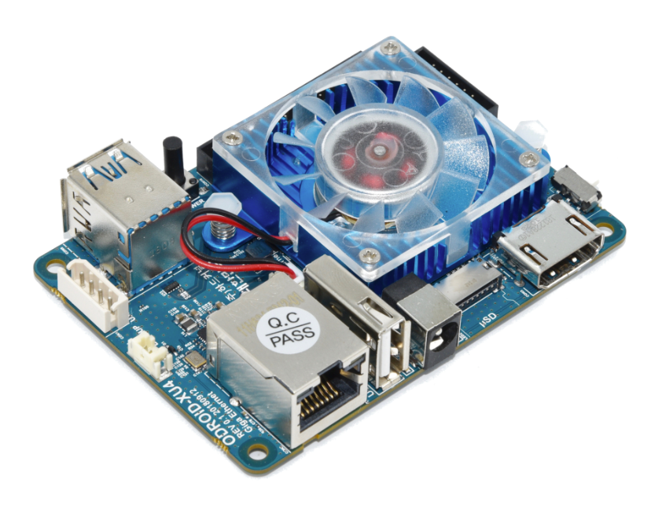

{
    "title": "CUPS on Armbian for boredom and debt",
    "description": "Setting up an Odroid XU4 as a local network print server",
    "tags": ["cups", "printer", "canon", "odroid", "networking"],
    "date": "2022-10-08T18:14:15-03:00",
    "categories": ["Networking", "Printer", "Armbian", "Odroid", "Tutorial"],
    "type": "article",
    "weight": 0,
    "publishdate": null,
    "expirydate": null,
    "aliases": null,
    "slug": "cups_on_armbian_for_boredom_and_debt",
    "url": ""
}

After some very expensive shenangians with my old Raspberry Pi 3B+ and a screwdriver (more to come) I found myself in need of a new device for my print server

This is easy to achieve I feel that I had to go through many guides and troubleshooting posts before making it work as expected so I'm making yet another guide in hopes to cover all aspects of it for your home server

## Odroid SoCs



Odroid series are a Raspberry competitor line of SoCs made by Hardkernel, a South Korea company which offers a very wide variety of SoCs and more consumer-oriented devices based on several chips (Exynos, Rockchip, Amlogic). One of their popular boards is the [Odroid-XU4](https://wiki.odroid.com/odroid-xu4/odroid-xu4), which, while lacking in some features to the Raspberry 4 it offers similar specs at a more reasonable price (scalpers considered). A plus on this model is that it comes with an extension port for an eMMC storage, which outperforms microSD by a large margin on I/O. Oh, and it has a power button

## Printing over the network

Having to print over the USB wire is only valid if the host is connected to the printer and said printer is on the side of said host. Having the printer far away, or introducing multiple devices as print sources complicates this a bit

Instead of sending files over emails, pendrives or having to do strange movements with your USB cables, having a single point is more useful, and even needed. A print server is essentially that: you have your printer visible over the network from any device connected in the same network

### CUPS

[CUPS](https://www.cups.org/) (Common UNIX Printing System) is an open source print server developed and maintained by Apple, designed to enable administration of printers and jobs over a network. It is also very lightweight and can be used on minimal distribution without many dependencies

### Armbian

[Armbian](https://www.armbian.com/) is an open linux ARM distro targeting a lot of development boards, and up to date (current releases are based on Ubuntu Jammy)

While Odroid provides official builds for the XU4, these are based on Ubuntu Focal and Armbian's are more updated. It also provides more useful a barebones distro optimized for the board and other future purposes (since this board is extremely overkill for a print server, I know)

## CUPS setup on Armbian

Aside from being an armhf distro, Armbian is pretty mature and the setup is as straightforward as it is on other platforms (and it also has a configuration wizard for the first boot, allowing the user to choose between bash and zsh). The gist here is getting around printer drivers and configuration

### Dependencies

The first step is to install CUPS, its PDF backend, the GIMP driver backends and the printer backend for Canon BJNP protocol (pretty important if, well, you're using a Canon printer). Second step is to create an user (call it `cupsadmin`) and add it to the `lpadmin` group, which is the one authorized by the CUPS service for most operations. Also, samba to enable network access to the PDF printer destination

```shell
sudo apt-get install cups cups-pdf printer-driver-gutenprint cups-backend-bjnp samba
sudo useradd -g lpadmin cupsadmin
```

### Base configuration

Following step is to configure everything. With this basic configuration, we're telling CUPS to enable LAN access to its web interface on port 631 (its default) requiring the credentials of any user belonging to the `lpadmin` grpup (namely, `cupsadmin`, but can be whichever you want). 

Using the example base configuration, make the following changes to `/etc/cups/cupsd.conf`:

```config
Browsing On

# Disable cups internal logging - use logrotate instead
MaxLogSize 0

# Log general information in error_log - change "warn" to "debug"
# for troubleshooting...
LogLevel warn
#PageLogFormat

Listen /run/cups/cups.sock
Listen 0.0.0.0:631
Port 631

# Show shared printers on the local network.
Browsing On
BrowseLocalProtocols dnssd

LogLevel warn
MaxLogSize 1m

Listen 0.0.0.0:631
Listen /run/cups/cups.sock
Port 631
Browsing On
BrowseLocalProtocols dnssd
DefaultAuthType Basic
WebInterface Yes

<Location />
  Order allow,deny
  Allow localhost
  Allow from 192.168.*.*
  Allow from 10.0.*.*
</Location>
<Location /admin>
  AuthType Basic
  Require group lpadmin
  Allow all
  Order allow,deny
</Location>
<Location /admin/conf>
  AuthType Basic
  Require group lpadmin
  Allow all
  Order allow,deny
</Location>
<Location /admin/log>
  AuthType Basic
  Require group lpadmin
  Allow all
  Order allow,deny
</Location>

MaxJobs 0
PreserveJobFiles No
PreserveJobHistory No
```

### Adding printers

Paraphrasing [Robert van den Aker](http://distro.ibiblio.org/smeserver/contribs/rvandenaker/testing/smeserver-cups/documentation/howtos/cups-pdf-printer.html)

1. Access the CUPS web interface through the printers panel in the server-manager. Accessing it this way rather than directly has the advantage that you'll already be logged into the server-manager for "synchronizing the printer lists", which you need to do after adding or deleting printers through the CUPS web interface. Log on to the CUPS web interface as "admin".
2. In the CUPS web interface, choose "Do Administration Tasks", then choose "Add a New Printer". The local devices visible by CUPS will be available to add as a service printer. I have a Canon G3100 so I have these options: 
   * CUPS-BRF (Virtual Braille BRF Printer)
   * Canon G3000 series (Canon G3000 series)
   * CUPS-PDF (Virtual PDF Printer) 
3. Pick a name for your printer. "Location" and "Description" are optional. Please note that the "Location" entry is meant for descriptive information about the physical location of your printer, like "Printer room" or "Cupboard upstairs" or even "Honolulu" if you do remote printing. In the case of a PDF printer there is no physical printer location and you can leave this empty.
4. Select the `Share this printer` checkbox, this is very important for it be network-accessible
5. Press `Continue`.
6. Select a driver. As the one I need is provided by gutenprint, in my case it is `Canon PIXMA G3000 - CUPS+Gutenprint v5.3.3`. CUPS provides generic and raw drivers if needed
7. Press `Add Printer`

To add the PDF printer as a network device, steps are the same (minus the driver selection).

#### Default settings

If having multiple printers like the physical and virtual PDF devices it's a good idea to set the physical as the server default (Select your printer in the `Printers` section and then select the `Set As Server Default` action on the `Maintenance` dropbox)

While it's the host OS the one that defines the print's settings it's also a good idea to set the default options on the CUPS printer that match your device's specs. This is done by the `Set Default Options` action on the `Maintenance` dropbox. When getting the printer recognized over the network by a client the options will probably be to set up again the the device on that client, but it's important to keep consistency

#### PDFs over the network

To make the PDF printer fully functional there is a final step remaining which is configuring and sharing its output directory. Asuming user `cupsadmin`:

Set up the samba configuration:

```config
[sambashare]
    comment = Samba on Armbian
    path = /home/cupsadmin/sambashare/
    read only = no
    browsable = yes
```

And create a samba password for the user:

```shell
sudo smbpasswd -a cupsadmin
```

Now edit the CUPS-pdf config on /etc/cups/cups-pdf.conf and set the output directory to be the samba share:

```config
 Out /home/cupsadmin/sambashare/
```

Finally, restart the cups and samba services

```shell
systemctl restart cups
sudo service smbd restart
```

### Troubleshooting

I spent a couple of hours dealing with this (no so unusual) error on the CUPS server which made jobs fail silently:

```
HTTP_STATE_WAITING Closing for error 32 (Broken pipe)
```

There are lots of links when searching but it usually boils down to one of these:

* Network connectivity issue (firewall rules and whatnot)
* CUPS driver issue (this was my issue, I needed the BJNP backend for my Canon printer)

After sorting that out, I couldn't print in color. That required setting up appropiate defauls on the server printer and resetting the CUPS service

### Bonus track

On Armbian (and any linux distro in general), you can manually execute the `motd` scripts. The one that shows the sensor readings and system stats is this one:

```shell
zsh /etc/update-motd.d/30-armbian-sysinfo
```

(replace zsh if you didn't pick it up as the default shell)