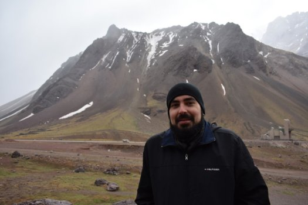
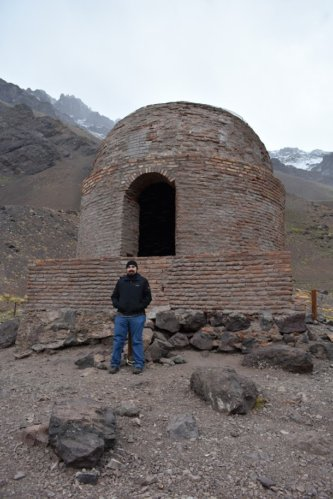

+++
title = "About me"
description = "About the blog author, Luis Gabriel Gomez"
type = "about"
date = "2019-02-28"
+++

**For my work experience instead of this page you may want to check this instead: [resume](../../../files/cv.pdf) ([sha256sum checksum](../../../files/checksum))**

I'm a software developer, occasional software architect, and jack of some trades based in Buenos Aires, Argentina. I can say that my job and hobby are software development and technology in general. I've worked at small scale in software factories, at large scale in an e-commerce giant and currently I'm helping redefine the technology stack of the local chapter of a multinational bank. I am a student of electronics engineering (formerly software engineering, but after getting that career on board, I guess I want to study something more personally fulfilling and in my list of TODOs).
I started as a full stack .NET developer (anyone remembers the simpler days with MVVM frameworks and JQuery?) but my main domain today lies in wrangling with backend systems and trying to keep them resilient and distributed, among other things.
My main tool of trade is golang as of today and I may rant about a lot of technologies and languages, but I certainly don't marry with any technology in particular. I still believe that certain tools are better suited for some scenarios than others.
I also like doing my job the best way I can (given the circumstances). While it is true that it rarely is a best (obvious) path to solve a complex scenario it is also true that the plethora of terrible solutions are  obvious, and I (and my team mates, luckily) do care for the execution of this trade-off as best as possible. 
I know there may look like there is some helpless vanity in this endeavor, like trying to take the best selfie on an impending snowstorm:

But in the __end__ of the day (__*end*__ may vary due to debugging circumstances) it is nice to see something durable that can withstand anything (__*anything*__ may also vary due to QA circumstances) and last for long, long time:

**PS:** I also like doing photography, but since this is something I do exclusively on vacations I consider it a no-op:

