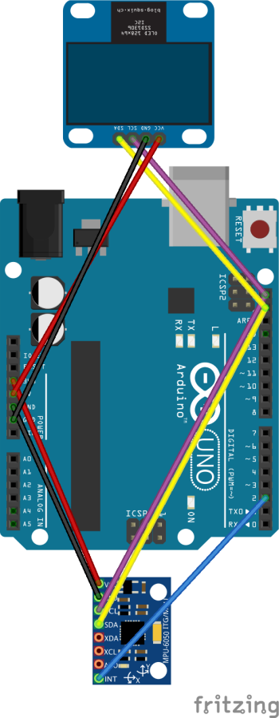
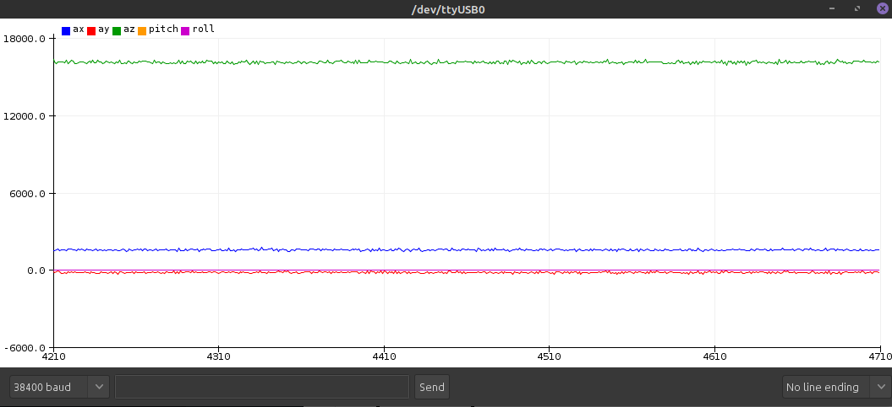
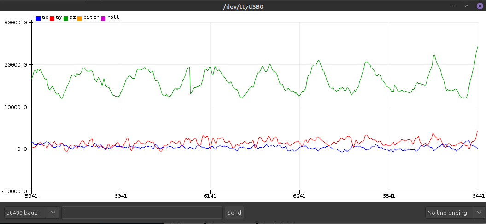
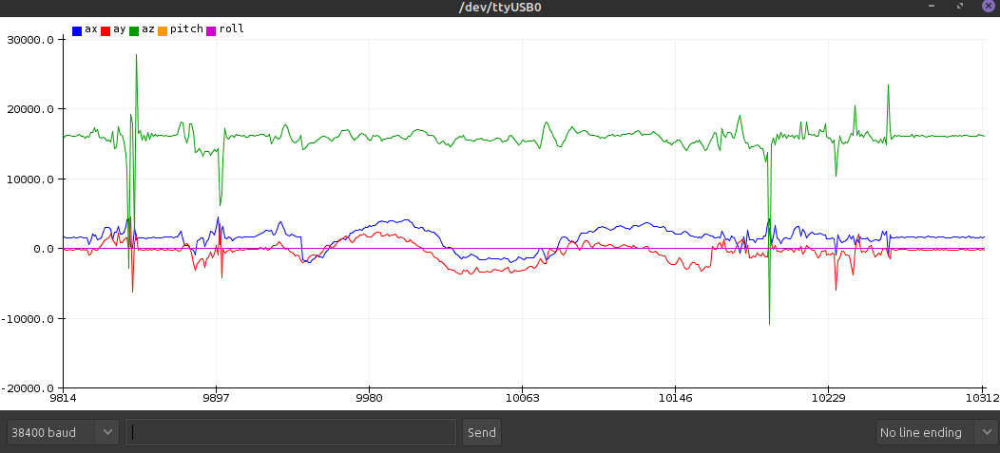
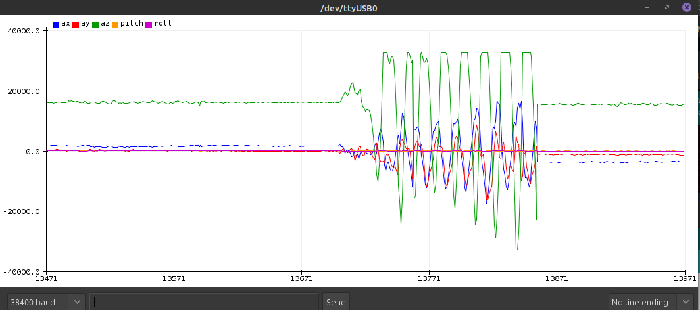
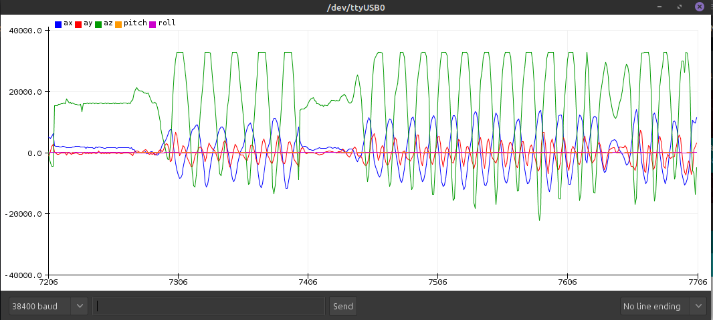

{
    "title": "Emulating a magic 8 ball",
    "description": "Emulating an 8 ball toy in Arduino Nano",
    "tags": ["Arduino Nano", "C", "Accelerometer", "Display"],
    "date": "2021-04-08T00:45:06-03:00",
    "categories": ["Programming", "Electronics", "Arduino", "Tutorial", "Network"],
    "type": "publication",
    "weight": 0,
    "publishdate": null,
    "expirydate": null,
    "aliases": null,
    "slug": "emulating_a_magic_8_ball",
    "url": ""
}


## The story 
I have to say, this is (and I just realized a couple of weeks ago) my longest lived project without being deprecated/abandoned. By the time of this publication, It's been already 3 years in the making. Why? well, mostly because of 3 things
1. It went though several reimplementations
2. It is a part-time, hobby project which involves hardware and I burnt a display in the process. That alone sends it to the bottom of the hobby projects triage
3. I did wrong some stuff and learned how to it right (or at least differently) during that time

When I was younger I had a magic 8 ball and it was one of my favorite toys, the notion of having a pseudorandom assistance was quirky and the toy's presentation itself has its mystique. Sadly, the liquid eventually evaporates and it breaks down with time.

A couple of years ago I wanted to dwell into [Arduino](https://www.arduino.cc). As a programmer with no electronics knowledge (even now, as I'm just starting my career at college) it is a wonderful platform to develop solutions as there are hundreds of components available and a programmable ecosystem that enables people to make projects with little circuitry knowledge.

I had an Arduino Uno, a display module and an accelerator module, so the idea pretty much came by itself, I wanted to emulate the 8 ball toy. The history of how I failed until I ended with the final prototype warrants a separate post so I will spare you the details, and will proceed to the implementation itself.

## tl;dr - Gimme the repo 
The sketchbook repo is available at https://github.com/lggomez/arduino-8ball

## Schematics 
This is the starting schematic of the project, which consists of the following components:
* Arduino Nano (optionally using an Arduino Uno board for development)
* sh1106 display module
* MPU6050 accelerometer module

Or, more realistically, in the protoboard:


## Working on the implementation 

### High level algorithm 
The Arduino runs on a loop so any algorithm must be iterative (and absolutely makes sense, particularily for our case). The main flow is as follows:
1. Initialize the display and accelerometer modules
2. Calibrate the accelerometer
3. Start main loop
4. Read data from accelerometer
5. If a shake was detected, increment counter
6. If counter reaches threshold (let's stay at 5) display a random 8ball message
7. Reset counter and display
8. ___***Goto 4***___

**Steps 1b and 4b (optional):** Initialize and reset the watchdog timer. A watchdog is a parallel processor which will reset the Arduino, should the configured time threshold by the main loop pass. This is useful to have an automatic soft reset in case the Arduino hangs by a bug
Before going into the display or accelerometer details, let's talk about memory.

### Memory usage - A small preface 
The Arduino Nano has the following memory specs:
* Flash (program) Memory: 32 KB of which 2 KB used by bootloader (leaving 30720 bytes)
* SRAM: 2 KB (2048 bytes)

So, we aren't exactly working with a JVM heap in here. One must be careful with their dependencies (this includes the libraries used to handle to modules) and the code itself, notably string handling. As an example, most, if not all of the string literals used on the sketch are stored in program memory instead of the dynamic memory

Another potential pain point is something as simple as having debug information.

This is a comparison between the memory usage with full debug information:

___***Sketch uses 21108 bytes (68%) of program storage space. Maximum is 30720 bytes.**
**Global variables use 1905 bytes (93%) of dynamic memory, leaving 143 bytes for local variables. Maximum is 2048 bytes.**
**Low memory available, stability problems may occur.***___

... and with no debug information:

___***Sketch uses 19146 bytes (62%) of program storage space. Maximum is 30720 bytes.**
**Global variables use 1799 bytes (87%) of dynamic memory, leaving 249 bytes for local variables. Maximum is 2048 bytes.**
**Low memory available, stability problems may occur.***___

### Display - Porting fizzlefade 
I wanted to add display transitions between messages, and so I found this [great article](https://fabiensanglard.net/fizzlefade/index.php) from Fabien Sanglard describing the original fizzlefade effect from Wolfestein 3D, and providing a C implementation. Porting this implementation to the Arduino nano, and specifically to the 128x64 sh1106 display provided some additional challenges:
* We'll be using a single, full display page buffer. The tradeoff comes cited in the [documentation](https://github.com/olikraus/u8g2/wiki/u8g2reference#firstpage) of the library: __Always redraw everything. It is not possible to redraw only parts of the content. The advantage is lesser RAM consumption compared to a full frame buffer in RAM.__ This last part of the sentence is rendered void for us, but for the following reason
* Making individual pixel writes to the device removes the memory limitations, but is is very slow and not feasible on the long run. Page size can also be smaller, but it won't have a noticeable performance effect and it will, in fact, be slower sending 4 pages than performing a single flush of a larger page

With this in mind, I made an implementation with the following optimizations that proved to work:
1. Initialize a full-size display buffer page
2. Perform the pseudorandom pixel pickup with with the fizzlefade LFSR algorithm
3. Every certain amount of iterations flush the buffer (write) to the screen. this includes the writing and centering of the string message as a 'negative' on the previously written buffer
 
As a possible optimization, we could the string messages as a set of coordinates to avoid (or draw as a negative of the current display mode) instead of drawing the entire string on each buffer flush. But precalculating this is madness, and for storage reasons we would have to encode these in a form different than a sparse matrix (I would like to see the trade off against writing against the buffer, I doubt the effort required is worth it).

The display code can be seen below (sans debug output sections)

```c
/*
    Modified fizzlefade implementation for Arduino integrated with u8g2 display
    See http://fabiensanglard.net/fizzlefade/index.php for details on the original
    Changes include:
      - Fade to a given text message
      - Send buffer to display every FIZZLEFADE_BUFFER_THRESHOLD iterations instead of doing it for each pixel to improve performance
      - Support for fill or clear mode
*/
void fizzlefade_message(char* charMessage, fizzlefade_mode mode)
{
  u8g2.firstPage();
  u8g2_uint_t fizzlefade_iterations;
  byte lineCount = getLineCount(charMessage);
  if (mode == clear) {
    // Fill the display at start if mode is clear
    drawFill();
  }
  do {
    uint32_t rndval = 1;
    u8g2_uint_t x, y;
    fizzlefade_iterations;
    
    // Start the fizzlefade LFSR loop
    do
    {
      y =  rndval & 0x000FF;        /* Y = low 8 bits */
      x = (rndval & 0x1FF00) >> 8;  /* X = High 9 bits */
      unsigned lsb = rndval & 1;    /* Get the output bit. */
      rndval >>= 1;                 /* Shift register */
      if (lsb) {                    /* If the output is 0, the xor can be skipped. */
        rndval ^= 0x00012000;
      }
      // If pixel is within bounds, count it as a batch iteration and start message print
      if (x <= SH1106_WIDTH && y <= SH1106_HEIGHT) {
        fizzlefade_iterations++;
        fizzle_message(x, y, charMessage, lineCount, mode, fizzlefade_iterations);
      }
    } while (rndval != 1);
  } while (u8g2.nextPage());
}

// fizzle_message draws the random pixel provided and prints the message into the display buffer
// if the iterations match FIZZLEFADE_BUFFER_THRESHOLD, the string will be writter and the
// buffer will be written to the display
void fizzle_message(u8g2_uint_t x, u8g2_uint_t y, char* charMessage, byte lineCount, fizzlefade_mode mode, u8g2_uint_t fizzlefade_iterations)
{
  if (mode == clear) {
    u8g2.setDrawColor(0);
  }
  u8g2.drawPixel(x, y);
  if (fizzlefade_iterations % (FIZZLEFADE_BUFFER_THRESHOLD + 1) == FIZZLEFADE_BUFFER_THRESHOLD) {
    printMessage(charMessage, lineCount, mode);
    u8g2.sendBuffer();
  }
  u8g2.setDrawColor(DEFAULT_DRAW_COLOR);
}

// printMessage prints a string message into the display page buffer, centering it
// TODO: the centering is still a bit off to the left in certain cases
void printMessage(char* charMessage, byte lineCount, fizzlefade_mode mode) {
  u8g2.setDrawColor((mode == clear) ? 1 : 0);
  char* buf;
  for (byte i = 1; i <= lineCount; i++) {
    buf = subStr(charMessage, "\n", i);
    byte x_offset = (strlen(buf) % 2) * floor(FONT_WIDTH / 2);
    byte x = (SH1106_WIDTH / 2) - (FONT_WIDTH * floor(strlen(buf) / 2)) - x_offset;
    byte y_offset = floor(1 - (0.5 * (lineCount - 1))) * FONT_HEIGTH;
    byte y = UPPER_MARGIN + (FONT_HEIGTH * i) + y_offset;
    u8g2.drawStr(x, y, buf);
  }
}

// getLineCount retuns the line count of a string given by the newline delimiter \n
byte getLineCount(const char* charMessage) {
  byte lineCount = 1;
  for (; *charMessage; charMessage++)
    lineCount += *charMessage == '\n';
  return lineCount;
}

// subStr returns a substring defined by a delimiter at an index
char* subStr(char* str, char *delim, byte index) {
  char *act, *sub, *ptr;
  static char copy[MAX_MESSAGE_LENGTH];
  byte i;
  // Since strtok consumes the first arg, make a copy
  strcpy(copy, str);
  for (i = 1, act = copy; i <= index; i++, act = NULL) {
    sub = strtok_r(act, delim, &ptr);
    if (sub == NULL) break;
  }
  return sub;
}
```

### Accelerometer - Playing with IMUs 
As I would discover soon, this project tasked me with playing with IMU's (Inertial Measurement Units) which by itself be easy, or difficult. Not because of the precision (in this case!) of the sensors, but mostly because of how the programmer wants to handle the sensor data. In the most elemental form, we are given the following data that compose the degrees of freedom (in this case 6) of the form:
* **Acceleration:** From the 3D space, in form of the vector ax, ay, az
* **Gravity:** Also from the 3D space, in form of the vector gx, gy, gz

The general algorithm for the 8 ball is as follows:
1. Start sensor, calibrate it and start main loop, taking IMU measurements
2. Detect the position and compare with the previous measurement
3. If a shake was detected (that is, a perturbation was established well enough to classify the sensor state delta as one) increment the movement
4. If some time was elapsed without any shakes, reset the counter (as it should be cumulative only over a small window of time)
5. After a certain amount of shakes (say, 5), pick a random message and show it on display as explained on the previous section.  Depending on how you want to consider the shakes (just a movement, or the combination or 2 movements: move up & move down) this part of the implementation may vary
6. Reset shake counter and display
7. Goto 2 (next main loop iteration)

The main algorithm itself isn't very sophisticated, but the complicated question in this part is: what __**is**__ movement?  we have 2 vectors with instant measurements but a simple comparison won't do it, and we must find a way to be able quantize and compare the state of the sensor.

#### Using filters 
In the end I used a complementary filter, which simplifies the measurement into pith and roll as units of measurement. [Pieter Jan](https://www.pieter-jan.com/node/11) made an implementation and a post which I will just link here and recommend instead of replicating.

#### Analysing sensor output 
The Arduino IDE can easily help visualize the output of sensors via serial logging and its serial monitor tool. It only requires two things:
* Serial output must be of the form "label1:variable1, label2:variable2, ..."
* A separate printing macro should be used for this mode since any distinct output may corrupt the graph (and it doesn't have a reset button yet)
  
##### 1 - Standing still 


##### 2 - Slow, continued movements (no shaking) 


##### 3 - Some random movements 


##### 4 - Shake and message 
Notice the continued, consistent movements and the pause during the message


##### 5 - A bug? only first series of shakes detected 
Cannot reproduce it always but yeah, bugs happen (even on blog posts)


...and that's it for now. There may still be things to iron out but I'm pretty happy with how this turned out, all things considered. 
