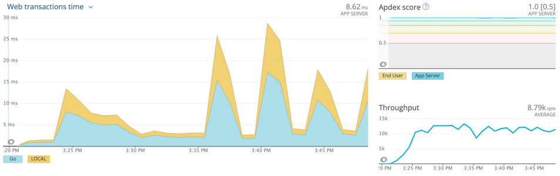
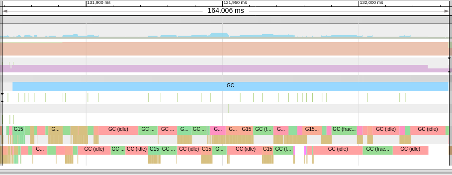
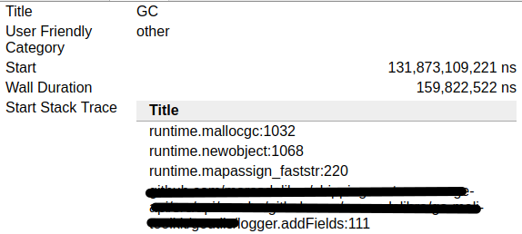
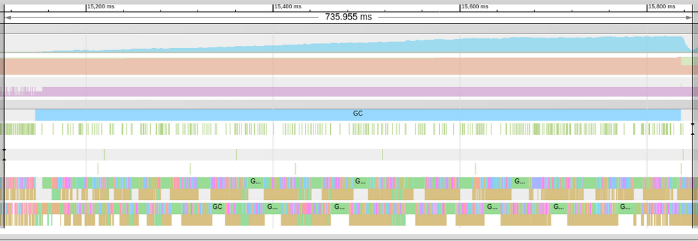
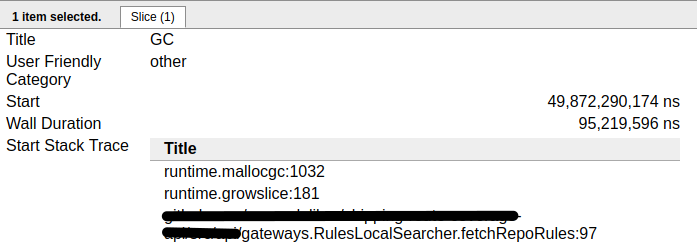
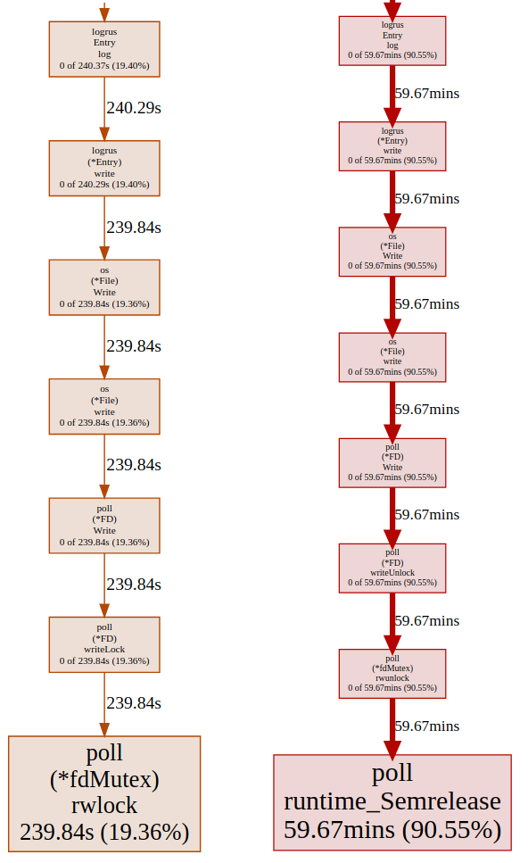
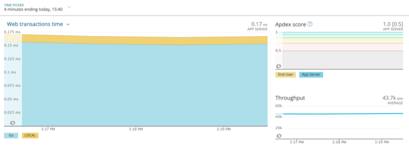
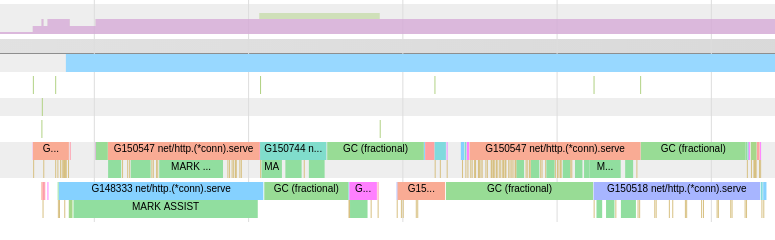
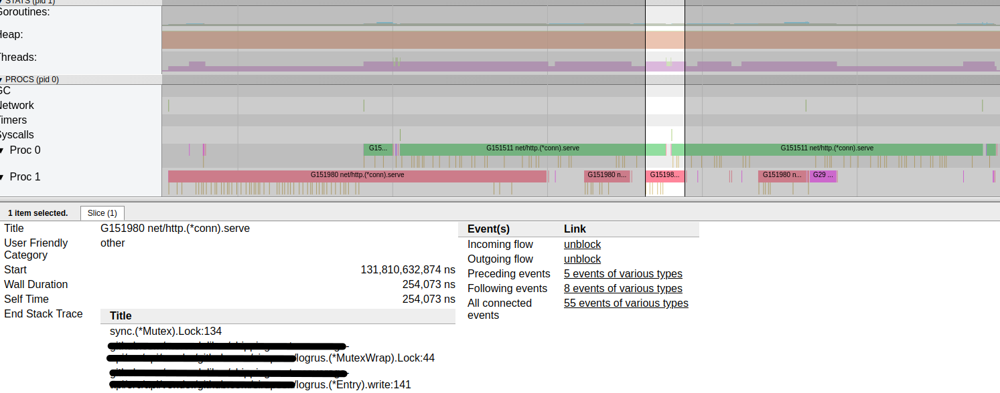

{
    "title": "Log everything, just not every single thing",
    "description": "A reminder that we should log, but maybe not just everything. And a performance rabbit hole",
    "summary": "A reminder that we should log, but maybe not just everything. And a performance rabbit hole",
    "tags": ["Golang", "Post-mortem"],
    "date": "2021-01-02T20:27:57-03:00",
    "lastmod": "2021-01-02T20:27:57-03:00",
    "categories": ["Programming", "Backend", "Bug"],
    "type": "",
    "weight": 0,
    "publishdate": null,
    "expirydate": null,
    "aliases": null,
    "slug": "log-everything-just-not-every-single-thing",
    "url": ""
}

___***This is a public post-mortem that was intended to be released on the engineering blog of MercadoLibre, but my departure (and the slowness of the editing) prevented that.***___

___***(This post is the full version of my [Go meetup Buenos Aires 2019 II](https://go-talks.appspot.com/github.com/lggomez/go-talks/2019/12-18-MELI/gophers-attack.slide#1) presentation).***___

## Going from apicall to in-memory transaction 
As a part of the job I was doing at the time to scale the shipping delivery calculator, one of the next steps involved migrating an API (route coverage) to an in-memory mixed model. In other words, we had to store in memory all the documents we were reading from our ElasticSearch cluster.

What I didn't know is that a benchmarking adventure would await, and that the culprit was something I could've never taken into account until that moment.

## What happened? 
  
Usually the first steps on for a task of this type consists on developing a proof of concept project with mocked data in the in-memory storage. Once the build passed and some sanity tests were performed, we proceeded to perform the stress test, and that's when things got weird:



The spikes immediately point out to the GC (garbage collector), and almost confirm it as the culprit if you observe them: the first curve belongs to the in-memory repo initialization, and the next spikes belong to the GC pauses induced by incoming traffic.

There were no suspicious things on the memory side so we had to tread more carefully with the help of pprof, and a gingonic handler which exposes its endpoints with some extra facilities (https://github.com/DeanThompson/ginpprof).

This one is a particular case: we don't have directly observable heap problems but we do have heavy pauses and/or latency on the request times, the the last time goes on the trace.

## Trace: that cool but introverted friend 
Some parts of the go tooling are both a blessing and a curse. While being very powerful to the developer, the commandline API and its documentation (is there is any at all) leaves a bit to be desired, sometimes being a bit esoteric and hard to follow.

I'd dare to say that this is the case with some of the most specific tools of the profiling toolchain in go like pprof and trace, but fortunately the community comes to the rescue!.

For the case of go case and the execution tracer (graphic frontend for go trace files) there is a fantastic tutorial made by Rhys Hiltner: https://about.sourcegraph.com/go/an-introduction-to-go-tool-trace-rhys-hiltner.

## Trace crach course 

#### Get an application's trace: 
1. Turn on and expose pprof on said up (as mentioned above with https://github.com/DeanThompson/ginpprof)
2. run `curl http://my-app.com/debug/pprof/trace?seconds=60 > foo`
3. ???
4. Profit! once those 60 seconds passed, we'll have the trace file named foo downloaded containing the profile data for our running application
   
#### Visualize a trace file: 
1. run `go tool trace foo`
2. ???
3. Profit? maybe... time to start looking for stuff now
With these tools we can start investigating

## Preliminary results 

### First culprit - Garbage Collector 
Upon seeing the trace the first observation is that a STW (stop the world) GC cycle takes a long time (164 milliseconds), and we also see an abnormal increase in the goroutine count (probable expected due to the still incoming flux of requests to the application). This API version does no explicitly create goroutines at no point in any hot path so we suspect there is a contention issue, which would explain the timing increase and also the increase of the blocking GC mark cycles:



Another crucial information is that the CG trigger on all instances is logrus (the logging package used by our toolkit):



### Second culprit - Logger/logrus 
To discover the root cause of these contention spikes, I proceeded to check and compare the trace's ___***Synchronization blocking profile***___ and ___***Scheduler latency profile***___ sections, which provided valuable information.

The contention in this scenario came from a mix of goroutines taking ownership of a mutex vs the unlock being parked by the runtime scheduler. We can see it by comparing the blocking and synchronization profiles:


### Third culprit - runtime and instance
Another, more down to earth reason of the application's degradation is that the go runtime is using just 2 OS threads to serve goroutines. This is defined in go 1.x by the environment variable `GOMAXPROCS`, and in the trace itself is given by the number of procs recorded:


And for further confirmation, you can log the value returned by `runtime.GOMAXPROCS(0)`, which in this case will be equal to 2. The setup and benchmarking of this variable is beyond the scope of this article, so as last detail I will add that by default the go runtime uses the number of logical CPU cores as its value.

Now that we have the data, it is time to start fiddling with the code

## First round - The logger 

Logrus, effectively serializes its writes via a mutex, workflow which comes turned on by default. On a [readme](https://github.com/sirupsen/logrus#thread-safety) section, it can be noted that it can be disabled on some scenarios, so that was my next step, and, surprisingly, things got even worse than before:





This time, the contention and GC times went way up 50~100x and 7x respectively).

### Hey, what happened? 
Going back to the trace profiles, I see that the writes keep serializing, but this time using a different kind of semaphore:



### Cure via amputation 
Upon seeing this, I realized the easiest way to confirm the logger as the (triggering) root cause was to remove it from all hot paths and voilà:



Now __these__ are the numbers we all wanna see on an in-memory API, don't we?

But still, I kinda want a more satisfactory explanation for this issue and I'm already halfway the rabbit hole, so here I go...

## Second round - Locks 

As it turns out, locks are one of those things whose implementation may seem easy(er) on a CS course level but once we talk about runtimes and operative systems we get into the __'here be dragons'__  territory very quickly, always in a huge mix of trade-offs and complex use cases.

As we saw before, we dealt with two different mutex variants, so it's worth taking a look at the performance implications of each one
The traditional [sync.Mutex](https://golang.org/src/sync/mutex.go) does a whole lot of stuff, including the following:
* Using internal sync primitives to handle internal runtime semaphores
* Handling the necessary spin and CAS operations to contain goroutines competing to acquire the lock
* It has a mixed operation mode: by default the ownership passage is FIFO + incoming goroutines, and if the acquisition time exceeds 1 millisecond for any waiter the mutex goes into starvation mode. Under this mode, several heuristics ensure that all waiters get served and mitigates tail latency, but global wait times increase and performance can degrade if the mutex operates consistently under this mode

The last point was key contributor on the benchmarked issues
On the other side, I found the internal [fdMutex](https://github.com/golang/go/blob/master/src/internal/poll/fd_mutex.go), which is a specialized mutex that serializes file descriptor accesses. If we cite the [code](https://github.com/golang/go/blob/master/src/internal/poll/fd.go):

```go
poll:
// Package poll supports non-blocking I/O on file descriptors with polling.
// This supports I/O operations that block only a goroutine, not a thread.
// This is used by the net and os packages.
// It uses a poller built into the runtime, with support from the
// runtime scheduler.
poll/fdMutex
// fdMutex is a specialized synchronization primitive that manages
// lifetime of an fd and serializes access to Read, Write and Close
// methods on FD.
```

It's beyond saying that the I/O cost in the context of a goroutine exceeds the penalty of the previous in-memory lock. The case of avoiding serializations in memory inadvertently causing to increment the amount of I/O syscalls can be worse than the original issue.

## Final round - The Garbage Collector 
If you got to this point you had seen a lot of mentions to the GC in the traces and the article, and that's the hill this article dies on
Golang's garbage collector is a [very complex](https://golang.org/src/runtime/mgc.go) beast that takes a lot of work from us at cost of trade-offs that should be transparent to application developers, altough this doesn' always end that way.

I will paraphrase the [CoreCLR](https://github.com/dotnet/coreclr/blob/master/Documentation/botr/garbage-collection.md#goals-of-the-gc) preamble (which is also inspired on The Garbage Collection Handbook):
* GC cycles should occur with enough frequency so that the heap isn't overrun with unused objects (thrash) but at the same time occupying the least amount of CPU time
* GC cycles should be productive. If the GC reclaims a small amount of memory, both the GC cycle and the CPU time are wasted
* Each GC cycle must be fast. A lot of workloads have low latency requirements
* Managed code developers should not know much about the GC in order to reach a good memory usage from their code. The GC should adjust to satisfy different memory usage patterns

__Author's corollary: any sufficently bad algoritm will invalidate any of the previous points__

The Go GC is (loosely) based on the following principles:
* **Mark and Sweep:** Objects which are reachable by the program are marked as in-use. This demands traversing the object heap periodically
* **Tri-color algorithm:** 3 rotary colors are used to determine the reachability state and marking the of objects: white, grey and black
* **Concurrent execution:** With the exception of STW pauses on certain phases, the GC runs concurrently with the rest of the application

The GC life cycle is formed by the following steps:
1. Sweep termination (STW)
2. Mark phase
3. Mark termination (STW)
4. Sweep phase
5. once enough memory is alocated (GC trigger) `goto 1`


The GC is CPU intensive, employing heuristics to maximize procs usage between different operations modes (dedicated, idle and fractional GC) as it can be seen on the trace:



These heuristics force the CPU to work even under time frames that can worsen lock starvation, in the case of goroutines that end up giving running time to the scheduler.

In the following case, operating normally and outside a GC cycle, the goroutines are started and finished in a single time frame:


Under GC stress, the scheduler cannot grant enough time to the goroutine and the time frame partitioning can be seen for these goroutines, as it gives up running time and gets pre-empted multiple times by the scheduler until its finalization:



Add enough goroutines to the mix and each one will take an arbitrarily long amount of time and time frames to finish (as we saw with the starting issue).

## Conclusion 
The neat part about this conclusion is that applies to pretty much every managed runtime: learn to profile your applications, and also learn to have a small and sane level of distrust of every third party line of code you run, because even something as innocuous as a log has side effects in regards of performance.

Oh, and log everything, but just not every single thing.
