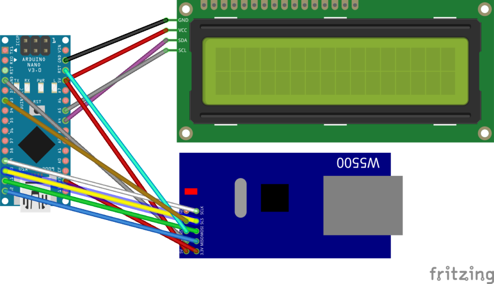
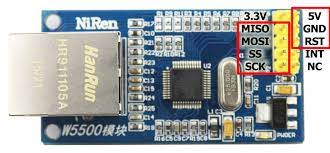
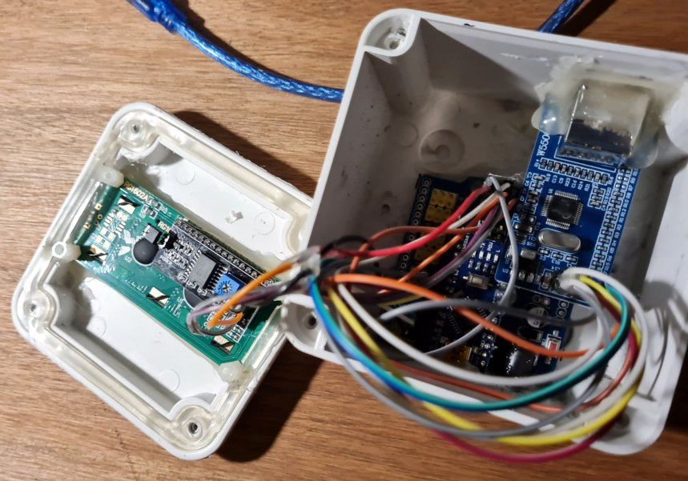
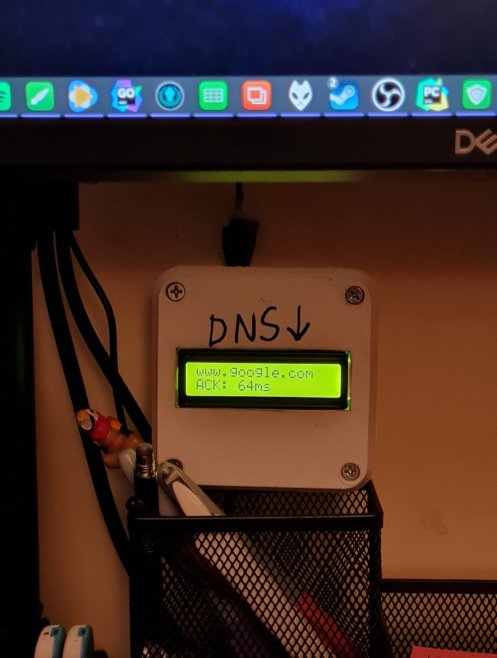

{
    "title": "Making a network canary",
    "description": "Creating a network canary device with an Arduino Nano",
    "summary": "Creating a network canary device with an Arduino Nano",
    "tags": ["Arduino Nano", "C", "Ethernet", "Display"],
    "date": "2021-03-11T00:27:03-03:00",
    "lastmod": "2021-03-11T00:27:03-03:00",
    "categories": ["Programming", "Electronics", "Arduino", "Tutorial"],
    "type": "",
    "weight": 0,
    "publishdate": null,
    "expirydate": null,
    "aliases": null,
    "slug": "making-a-network-canary",
    "url": ""
}

For those unfamiliar with the concept of canary, let's quote wikipedia first:
___Canaries were iconically used in coal mines to detect the presence of carbon monoxide. The bird's rapid breathing rate, small size, and high metabolism, compared to the miners, led birds in dangerous mines to succumb before the miners, thereby giving them time to take action.___

And so, the term canary spread to other fields, including software development. Usually, before screwing things up in distributed systems, the new version is tested in a single node; this modus operandi is called a canary deploy (how to mediate the state changes between the new and old versions is completely out of the scope of this article, sadly).  So, up to this point, the example is clear, a canary, conceptually, tests or measures something in case it goes awry.

What happens with networks? networks are hard. Network configurations are hard. Network proxies are hard, VPNs are ___hard___. Throw them all together in a mixed bag of custom configurations and you're in for a bad time, especially when checking connectivity. Same happens with smart ___< insert your favorite appliance here >___. Their networking stack and applications built on top of them, despite the resource constrains, are just not on the same league as the their PC (or even console, dare I say) counterparts. Why? It's all in the release cycles.

But whatever, back to the point. I've found myself enough time in the awkward situation of "false positives" in regards of internet connectivity with my smart TV and my work PC, so I wondered, ___why not a network canary?___

## TL;DR - I just want the repo 
https://github.com/lggomez/arduino-dns-canary

## The design 

The idea behind this is simple: having a network device directly connected to the router, with a minimal network stack (in this case, the arduino board and its standard library via a **W5500** ethernet controller)
On the software side, just a loop of TCP connections, cycling trough a list of well-known and always-up domains to test DNS resolution and measure connection time. That's it.

The details themselves on the connections can be found online and in the repo but the diagram is self explainatory (albeit unreadable on the W5500). The busiest part is the W5500 connection which may depend on the specific vendor board you get, but the following reference should follow pretty closely:

As for the display (this thing needs an UI after all) I went for a 16x2 char display with an **PCF8574T** I2C front board, which made the connections a lot easier (and even then, I decided to leave the shield to mount the prototype on its case).

## The prototype 
(Yeah, I noticed that input holes are not one sided. It's a prototype, sue me).

Tip: for a poetic finish, nothing fits better than a crappy writting vaguely stating the purpose of the artifact.

## Code 
See the link above at TL;DR.
